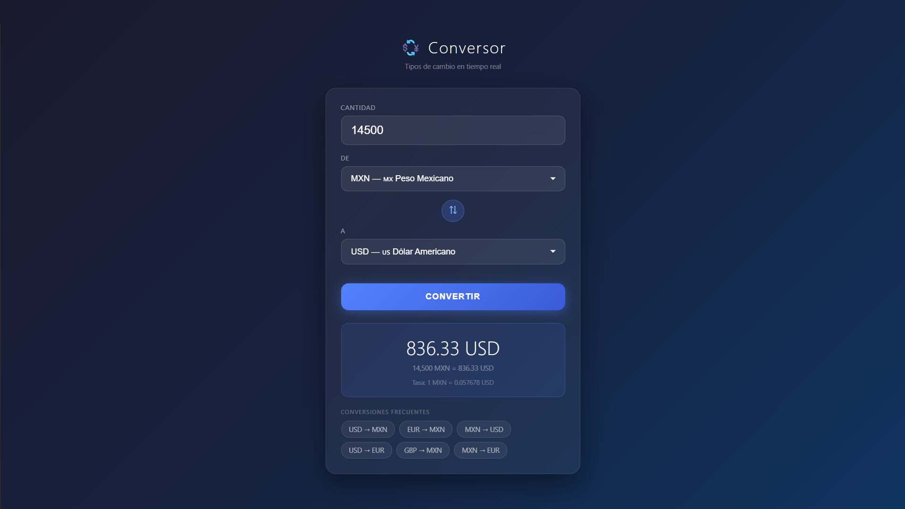

# 💱 Conversor de Monedas

Aplicación web para convertir entre diferentes monedas con tipos de cambio en tiempo real, desarrollada con HTML, CSS y JavaScript puro.

## ✨ Funcionalidades

- Conversión en tiempo real consumiendo una API pública
- Soporte para 14 monedas internacionales
- Botón para intercambiar monedas rápidamente
- Conversiones frecuentes con un solo click
- Muestra la tasa de cambio exacta utilizada
- Soporte para convertir con la tecla Enter

## 🚀 Tecnologías

- HTML5
- CSS3
- JavaScript
- API: Open Exchange Rates (open.er-api.com)

## 📸 Vista previa

## ▶️ Cómo usarlo

1. Clona el repositorio
2. Abre el archivo `index.html` con Live Server en VS Code
3. ¡Listo!

> Nota: Requiere conexión a internet para obtener los tipos de cambio.

## 👨‍💻 Autor

**Jorge Campos Albarado** — [GitHub](https://github.com/JorgeCA7)